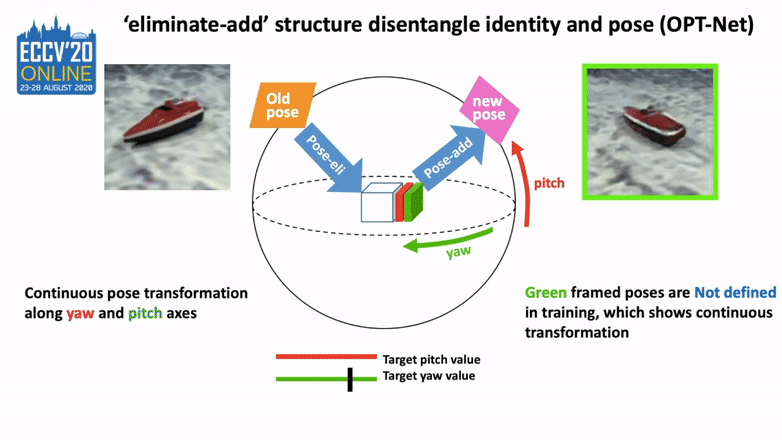
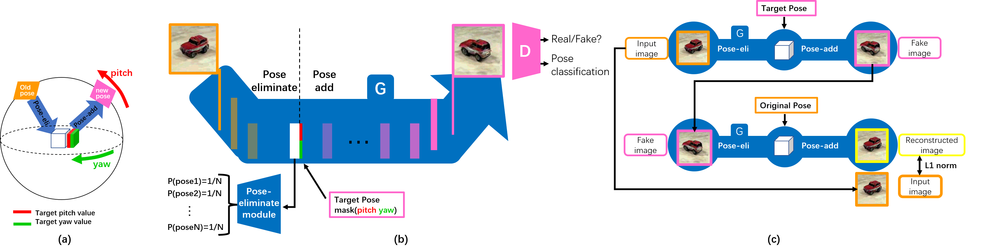
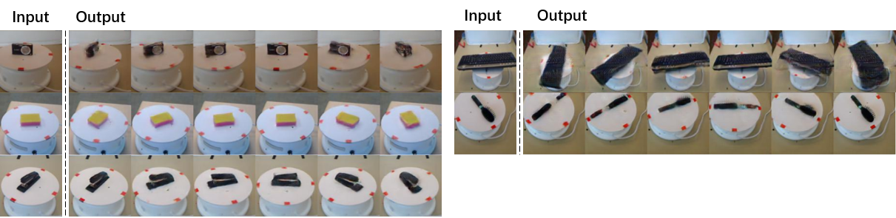

# Pose-Augmentation-Class-agnostic-Object-Pose-Transformation

The code of our PyTorch implementation for Pose Augmentation: Class-agnostic Object Pose Transformation for Object Recognition will appear soon. It is still under active development.

[Demo](https://youtu.be/uZS5JKMBDZA)

## Abstract

Object pose increases interclass object variance which makesobject recognition from 2D images harder. To render a classifier robust topose variations, most deep neural networks try to eliminate the influenceof pose by using large datasets with many poses for each class. Here, wepropose a different approach: a class-agnostic object pose transformationnetwork (OPT-Net) can transform an image along 3D yaw and pitch axesto synthesize additional poses continuously. Synthesized images lead tobetter training of an object classifier. We design a novel eliminate-addstructure to explicitly disentangle pose from object identity: first ‘elim-inate’ pose information of the input image and then ‘add’ target poseinformation (regularized as continuous variables) to synthesize any targetpose. We trained OPT-Net on images of toy vehicles shot on a turntablefrom the iLab-20M dataset. After training on unbalanced discrete poses(5  classes  with  6  poses  per  object  instance,  plus  5  classes  with  only  2poses), we show that OPT-Net can synthesize balanced continuous newposes along yaw and pitch axes with high quality. Training a ResNet-18classifier with original plus synthesized poses improves mAP accuracy by9% over training on original poses only. Further, the pre-trained OPT-Net can generalize to new object classes, which we demonstrate on bothiLab-20M and RGB-D. We also show that the learned features can gen-eralize to ImageNet. 

## Video
[1min-Highlight](https://youtu.be/WHAFj9KXRFY) [10min-Talk](https://youtu.be/9N8eyOmCWh4)

## Pipeline

## Performance

#### on iLab20M

#### on RGB-D

#### on ImageNet (Without Finetune)

## BibTex

@inproceedings{ge2020pose,
  title={Pose Augmentation: Class-agnostic Object Pose Transformation for Object Recognition},
  author={Ge, Yunhao and Zhao, Jiaping and Itti, Laurent},
  booktitle={European Conference on Computer Vision},
  pages={138--155},
  year={2020},
  organization={Springer}
}

